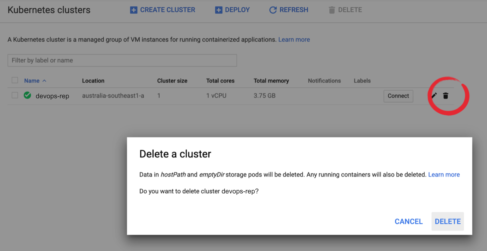

# Kubernetes 101: A Workshop

## What This Is

This is a workshop which introduces basic Kubernetes concepts - how to use it, why it's important, and where to get more information afterwards. This workshop is designed to be self-running, and contains practical and conceptual information inside the repository.

## Prerequisites (Docker)

If you haven't done the Docker workshop yet, [you can go through it here.](https://github.com/DevOps-Represent/docker-101)

## Prerequisites (Kubernetes)

#### The Really Easy Way (Using Google Kubernetes Engine)

We can run the workshop with **GKE (Google Kubernetes Engine)**, as part of Google Cloud. Google Cloud is one of the big three platform providers (along with AWS and Azure) that serve a lot of the industry - and signup is simple. It's also *free*, as long as we clean up later.

[Instructions are in this link](https://github.com/DevOps-Represent/kubernetes-101/blob/master/Setup-with-Google-Cloud.md). This is the best way to go!

## Prerequisites (Git)

[Setting up git](https://docs.github.com/en/github/getting-started-with-github/set-up-git)

After you've setup an environment with Docker and Kubernetes, you're going to need some files from this repository for parts of this workshop. Make sure you clone the workshop in your Google Web Console:

```
git clone https://github.com/DevOps-Represent/kubernetes-101.git
cd kubernetes-101
```

## The Workshop

 - [Part 0: Kubernetes Concepts.](https://github.com/DevOps-Represent/kubernetes-101/blob/master/0-K8S-Concepts.md) In this part, we'll review what Kubernetes is and why companies use it.

 - [Part 1: Kubernetes Basics, and the Command Line.](https://github.com/DevOps-Represent/kubernetes-101/blob/master/1-Kubernetes-Basics.md) In this part, we'll go through the Kubernetes command line, and make our way into creating our first objects.

 - [Part 2: Deployments and Services.](https://github.com/DevOps-Represent/kubernetes-101/blob/master/2-Deployments-and-Services.md) In this section, we'll go through how to make our pods available to the world, and how we can update them at scale.

 - [Part 3: Labels](https://github.com/DevOps-Represent/kubernetes-101/blob/master/3-Labels.md). In this section, we stitch everything together.


## After The Workshop

After the workshop, simply remove the cluster by clicking on the *bin* button on the cluster list page.



## Next Steps

*If you enjoyed working with Kubernetes for this workshop, you might be interested in the following:*

### Certified Kubernetes Adminstrator Exam
This workshop covers many of the fundamentals for doing your [Certified Kubernetes Adminstrator Exam](https://training.linuxfoundation.org/certification/certified-kubernetes-administrator-cka/)

Some topics to study further to help you pass the exam are

* The Kubernetes Command Line Tools - [kubectl reference](https://kubernetes.io/docs/reference/kubectl/)
* Pipes and Redirects
* Kubernetes and JSON

Extra Labs for you to try
* https://kubernetes.courselabs.co/