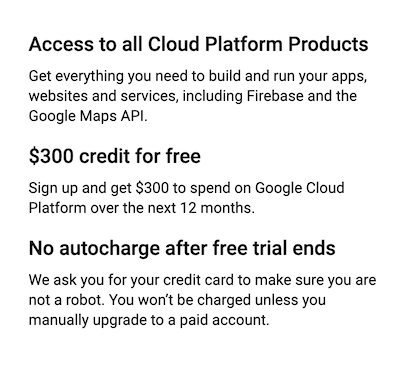
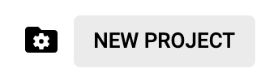
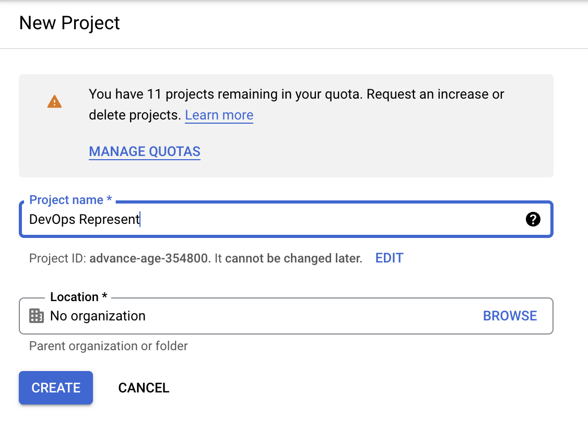
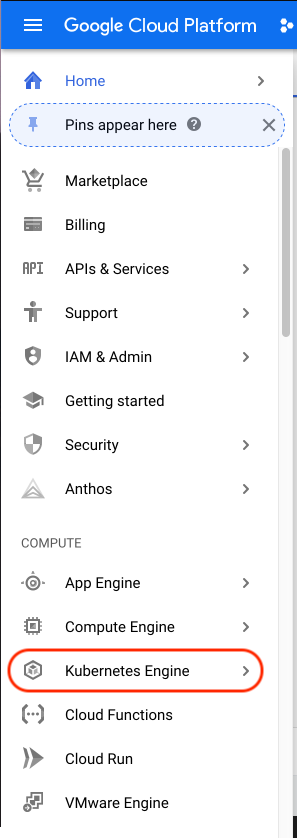
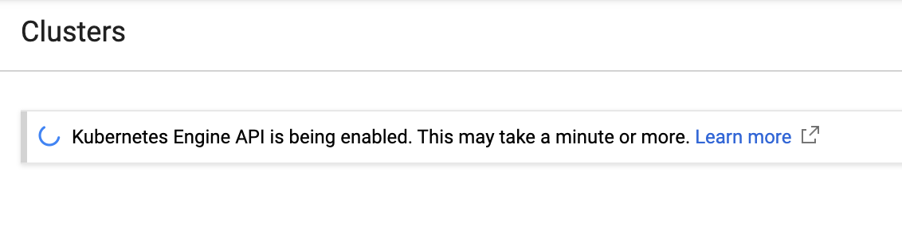
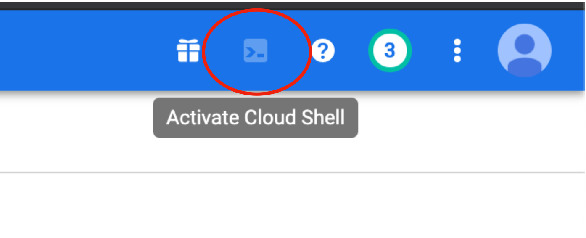
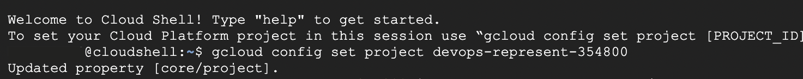
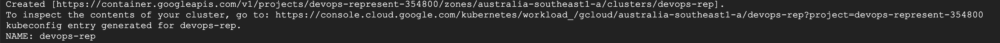
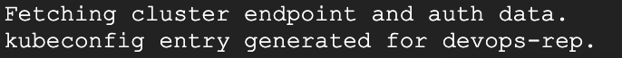

# Setting up with Google Cloud

We can use Google Kubernetes Engine (GKE) to run our Kubernetes cluster. Google Cloud has a *free tier*, which allows us to run a cluster for free - so long as we turn it off when the workshop ends.

### Signing up for Google Cloud

To sign up for Google Cloud Platform Trial (which includes *300.00 AUD* of credit), simply use your *Gmail* account to sign up using the form at: [https://console.cloud.google.com/freetrial](https://console.cloud.google.com/freetrial)

The trial may prompt you for credit card info - don't worry, we won't be billed if we clean up!



### Setting up a Project

Once you're signed up, we can create our project as follows:

1. From the top menu bar, click:


2. From the top-right, click:




3. Set up your new project as follows:



Once we select a project, it should start the Kubernetes Engine API. To see this, visit the [Kubernetes engine page](https://console.cloud.google.com/projectselector/kubernetes) in the Google Cloud console.



This will take some time - so grab a coffee, relax, and get ready! ☕️



Once this finishes, click on the Google Console button on the top-right of the page. This will enable a web console on the bottom of your screen - where you can type commands to interface with both *Google Cloud* and *Kubernetes*!



You're up and running when the console looks like this:




On the console, let's set our region. For this workshop, we'll be using `australia-southeast1`:

```
gcloud config set compute/zone australia-southeast1-a
```

After this, all we need to do is create a cluster. 

### Setting up a Cluster


Type in the following command to create a single-node cluster called `devops-girls` (Feel free to use any cluster name!):

```
gcloud container clusters create devops-girls --num-nodes=1
```
You'll see the following:

`Creating cluster devops-girls in australia-southeast1-a... Cluster is being health-checked...`

Like the previous steps, this may take some time - so maybe make another cup of tea. ☕️

You'll see the Google Cloud console doing a couple of things (which we'll talk about shortly). 

When it finishes, you'll see this:




Once it finishes, the only command left to run is to get the credentials to the cluster:

```
gcloud container clusters get-credentials devops-girls
```

Where `devops-girls` is what you called your cluster. And now you're done and you should see lines like this in your console!




<details><summary>Troubleshooting</summary><p>


If you get the following error when creating your cluster:

`ERROR: (gcloud.container.clusters.create) ResponseError: code=500, message=Internal error encountered.`

Try the following:
- Make sure you're in the correct Project


</p></details>