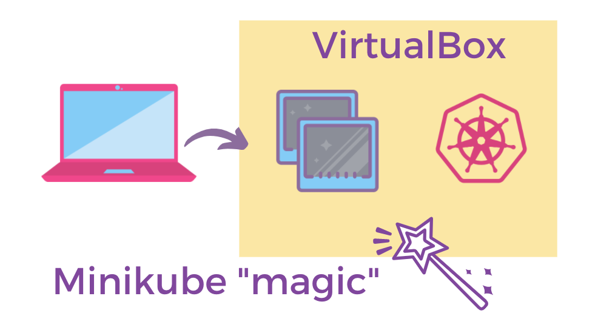

# Setup with Macs

### Installing a Hypervisor

A hypervisor allows you to create and run virtual machines. [VirtualBox](https://www.virtualbox.org/wiki/Downloads) will be the hypervisor we'll be using for this exercise, so make sure you download and install the packages for your operating system:

💻 [If you are using a Mac machine, use this link to download/install the lastest version of Virtual Box for Mac](https://download.virtualbox.org/virtualbox/6.0.14/VirtualBox-6.0.14-133895-OSX.dmg)

### Installing minikube

The easiest way to install `minikube` on Mac/OSX is to use Homebrew:

```
brew install minikube
```

### Installing kubectl

`kubectl` is the command line tool we'll be using to interact with our local cluster - and in fact, any Kubernetes cluster in general. 

To install `kubectl` in Mac/OSX, simply use Homebrew:

```
brew install kubectl
```

### Starting minikube

To start minikube, simply type the following in your terminal or command line:

```
minikube start
```

This will setup the virtual machines required to run a minimal Kubernetes cluster. Once `minikube start` is finished, you can specify the `minikube` context from your command line:

```
kubectl config use-context minikube
```

To verify that you're connected to the cluster, you can run the following command:

```
kubectl cluster-info
```

Huzzah! You're ready!



